# FSM Viewer/Simulator - Class Design

This design shows the intended C# architecture before implementation. The model is kept independent from parsing, validation, rendering, and user interface code so the project can grow toward simulation or a second UI later.

Implementation note: this diagram is the planning design. The implemented code follows the same layer boundaries and patterns, with small naming/signature differences documented in `docs/implementation-notes.md`.

## Class Diagram

```mermaid
classDiagram
direction LR

namespace Domain {
    class FsmDiagram {
        -Dictionary~string, State~ states
        -Dictionary~string, Trigger~ triggers
        -List~Transition~ transitions
        +IReadOnlyCollection~State~ States
        +IReadOnlyCollection~Trigger~ Triggers
        +IReadOnlyCollection~Transition~ Transitions
        +InitialState? InitialState
        +void AddState(State state)
        +void AddTrigger(Trigger trigger)
        +void AddTransition(Transition transition)
        +State? FindState(string id)
        +Trigger? FindTrigger(string id)
        +IEnumerable~Transition~ GetOutgoingTransitions(State state)
        +IEnumerable~Transition~ GetIncomingTransitions(State state)
        +void Accept(IFsmElementVisitor visitor)
    }

    class State {
        <<abstract>>
        +string Id
        +string DisplayName
        +State? Parent
        +IReadOnlyCollection~StateAction~ Actions
        +void AddAction(StateAction action)
        +bool IsNestedIn(State possibleParent)
        +void Accept(IFsmElementVisitor visitor)
    }

    class InitialState {
        +InitialState(string id, string displayName, State? parent)
    }

    class SimpleState {
        +SimpleState(string id, string displayName, State? parent)
    }

    class CompoundState {
        -List~State~ children
        +IReadOnlyCollection~State~ Children
        +CompoundState(string id, string displayName, State? parent)
        +void AddChild(State child)
    }

    class FinalState {
        +FinalState(string id, string displayName, State? parent)
    }

    class Transition {
        +string Id
        +State Source
        +State Destination
        +Trigger? Trigger
        +Guard Guard
        +TransitionAction? Effect
        +bool IsAutomatic()
        +bool IsSelfTransition()
        +void SetEffect(TransitionAction action)
        +void Accept(IFsmElementVisitor visitor)
    }

    class Trigger {
        +string Id
        +string Description
    }

    class Guard {
        +string Expression
        +bool IsEmpty()
    }

    class FsmAction {
        <<abstract>>
        +string Description
        +ActionType Type
    }

    class StateAction {
        +State Owner
    }

    class TransitionAction {
        +Transition Owner
    }

    class ActionType {
        <<enumeration>>
        EntryAction
        DoAction
        ExitAction
        TransitionAction
    }

    class IFsmElementVisitor {
        <<interface>>
        +void VisitDiagram(FsmDiagram diagram)
        +void VisitInitialState(InitialState state)
        +void VisitSimpleState(SimpleState state)
        +void VisitCompoundState(CompoundState state)
        +void VisitFinalState(FinalState state)
        +void VisitTransition(Transition transition)
    }
}

namespace Building {
    class FsmModelBuilder {
        -FsmDiagram diagram
        +FsmDiagram Diagram
        +State AddState(string id, string parentId, string name, StateType type)
        +Trigger AddTrigger(string id, string description)
        +Transition AddTransition(string id, string sourceId, string destinationId, string? triggerId, string guard)
        +FsmAction AddAction(string ownerId, string description, ActionType type)
        +FsmDiagram Build()
    }

    class StateFactory {
        +State Create(string id, string name, StateType type, State? parent)
    }

    class StateType {
        <<enumeration>>
        Initial
        Simple
        Compound
        Final
    }
}

namespace Parsing {
    class IFsmParser {
        <<interface>>
        +FsmDiagram ParseFile(string filePath)
        +FsmDiagram ParseText(string text)
    }

    class FsmTextParser {
        -FsmTokenizer tokenizer
        -FsmModelBuilder builder
        +FsmDiagram ParseFile(string filePath)
        +FsmDiagram ParseText(string text)
    }

    class FsmTokenizer {
        +IReadOnlyList~FsmDefinition~ Tokenize(string text)
    }

    class FsmDefinition {
        +DefinitionType Type
        +string RawText
        +int LineNumber
    }

    class DefinitionType {
        <<enumeration>>
        State
        Trigger
        Action
        Transition
    }

    class ParseException {
        +int LineNumber
        +string Message
    }
}

namespace Validation {
    class IFsmValidator {
        <<interface>>
        +IEnumerable~ValidationError~ Validate(FsmDiagram diagram)
    }

    class ValidationPipeline {
        -IReadOnlyList~IFsmValidator~ validators
        +ValidationResult Validate(FsmDiagram diagram)
    }

    class ValidationResult {
        +IReadOnlyList~ValidationError~ Errors
        +bool IsValid
        +static ValidationResult Success()
        +static ValidationResult Failed(IEnumerable~ValidationError~ errors)
    }

    class ValidationError {
        +string Code
        +string Message
        +string? ElementId
    }

    class DeterministicTransitionValidator {
        +IEnumerable~ValidationError~ Validate(FsmDiagram diagram)
    }

    class InitialFinalTransitionValidator {
        +IEnumerable~ValidationError~ Validate(FsmDiagram diagram)
    }

    class UnreachableStateValidator {
        +IEnumerable~ValidationError~ Validate(FsmDiagram diagram)
    }
}

namespace Presentation {
    class IFsmRenderer {
        <<interface>>
        +string RenderDiagram(FsmDiagram diagram)
        +string RenderState(State state)
        +string RenderTransition(Transition transition)
    }

    class ConsoleTextRenderer {
        -TextOutputBuilder builder
        -RenderContext context
        +string RenderDiagram(FsmDiagram diagram)
        +string RenderState(State state)
        +string RenderTransition(Transition transition)
        +void VisitDiagram(FsmDiagram diagram)
        +void VisitInitialState(InitialState state)
        +void VisitSimpleState(SimpleState state)
        +void VisitCompoundState(CompoundState state)
        +void VisitFinalState(FinalState state)
        +void VisitTransition(Transition transition)
    }

    class RenderContext {
        +int IndentationLevel
        +string Indent()
        +RenderContext NextLevel()
    }

    class TextOutputBuilder {
        +void AppendLine(string text)
        +string ToString()
        +void Clear()
    }
}

namespace Application {
    class FsmApplication {
        -IFsmParser parser
        -ValidationPipeline validationPipeline
        -IFsmRenderer renderer
        -IUserInterface userInterface
        +int Run(string[] args)
    }

    class IUserInterface {
        <<interface>>
        +string? GetInputFilePath(string[] args)
        +void ShowOutput(string output)
        +void ShowErrors(IEnumerable~string~ errors)
    }

    class ConsoleUserInterface {
        +string? GetInputFilePath(string[] args)
        +void ShowOutput(string output)
        +void ShowErrors(IEnumerable~string~ errors)
    }
}

FsmDiagram "1" o-- "*" State : contains
FsmDiagram "1" o-- "*" Trigger : contains
FsmDiagram "1" o-- "*" Transition : contains
State <|-- InitialState
State <|-- SimpleState
State <|-- CompoundState
State <|-- FinalState
State "0..1" --> "0..1" State : parent
CompoundState "1" o-- "*" State : children
State "1" o-- "*" StateAction : actions
FsmAction <|-- StateAction
FsmAction <|-- TransitionAction
Transition "1" --> "1" State : source
Transition "1" --> "1" State : destination
Transition "0..1" --> "1" Trigger : trigger
Transition "1" o-- "1" Guard : guard
Transition "1" o-- "0..1" TransitionAction : effect
FsmDiagram --> IFsmElementVisitor : accepts
State --> IFsmElementVisitor : accepts
Transition --> IFsmElementVisitor : accepts

FsmModelBuilder --> FsmDiagram : builds
FsmModelBuilder --> StateFactory : uses
StateFactory --> State : creates
FsmTextParser ..|> IFsmParser
FsmTextParser --> FsmTokenizer : uses
FsmTextParser --> FsmModelBuilder : uses
FsmTokenizer --> FsmDefinition : creates

ValidationPipeline --> IFsmValidator : runs
DeterministicTransitionValidator ..|> IFsmValidator
InitialFinalTransitionValidator ..|> IFsmValidator
UnreachableStateValidator ..|> IFsmValidator
ValidationPipeline --> ValidationResult : creates
ValidationResult o-- ValidationError

ConsoleTextRenderer ..|> IFsmRenderer
ConsoleTextRenderer ..|> IFsmElementVisitor
ConsoleTextRenderer --> RenderContext : uses
ConsoleTextRenderer --> TextOutputBuilder : writes to

FsmApplication --> IFsmParser : uses
FsmApplication --> ValidationPipeline : uses
FsmApplication --> IFsmRenderer : uses
FsmApplication --> IUserInterface : uses
ConsoleUserInterface ..|> IUserInterface
```

## Design Patterns

- Composite: `State` is the base class and `CompoundState` can contain child `State` objects. This supports nested compound states without special-case code.
- Factory: `StateFactory` creates the correct state subtype from the parsed `StateType`.
- Builder: `FsmModelBuilder` centralizes construction of the diagram and prevents parser code from directly wiring every relationship.
- Visitor: `IFsmElementVisitor` lets renderers or future traversal-based operations walk through the FSM model through `Accept(...)` methods without putting rendering logic inside the domain classes.
- Strategy: `IFsmValidator` lets multiple validation behaviors be swapped or extended independently.
- Pipeline: `ValidationPipeline` executes multiple validators and combines their errors.

## Layer Responsibilities

- Domain: FSM objects only. No console, file, or parser logic.
- Building: safe model construction and object creation.
- Parsing: input file syntax, tokenizing, and parse errors.
- Validation: semantic rules after parsing.
- Presentation: textual rendering of diagrams, states, and transitions.
- Application: connects parser, validators, renderer, and user interface.

## Assessment Notes

This design intentionally includes UI classes, enough model classes for modularity, explicit associations, and the intended design patterns. The final code may differ in small details, but the direction should remain: the domain model is reusable, validators are extendable, and a future simulation or second UI can be added without replacing the core model.
